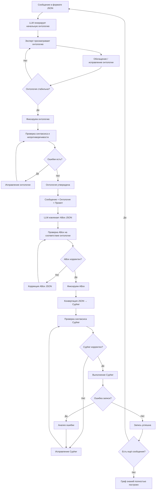

# Knowledge Graph Construction Pipeline

Below is the full workflow diagram rendered using Mermaid.

```mermaid
flowchart TD

%% ===============================
%% 0. ВХОД
%% ===============================

A[Сообщение в формате JSON] --> B[LLM генерирует начальную онтологию]

%% ===============================
%% 1. ЦИКЛ ДОРАБОТКИ ОНТОЛОГИИ
%% ===============================

B --> C[Эксперт просматривает онтологию]
C --> D[Обогащение / исправление онтологии]
D --> E{Онтология стабильна?}

E -- Нет --> C
E -- Да --> F[Фиксируем онтологию]

%% ===============================
%% 2. ПРОВЕРКА ОНТОЛОГИИ
%% ===============================

F --> G[Проверка синтаксиса и непротиворечивости]
G --> H{Ошибки есть?}

H -- Да --> I[Исправление онтологии]
I --> G
H -- Нет --> J[Онтология утверждена]

%% ===============================
%% 3. ИЗВЛЕЧЕНИЕ ABox (ДЛЯ КАЖДОГО СООБЩЕНИЯ)
%% ===============================

J --> K[Сообщение + Онтология + Промпт]
K --> L[LLM извлекает ABox JSON]

L --> M[Проверка ABox на соответствие онтологии]
M --> N{ABox корректен?}

N -- Нет --> O[Коррекция ABox JSON]
O --> M
N -- Да --> P[Фиксируем ABox]

%% ===============================
%% 4. КОНВЕРТАЦИЯ JSON → CYPHER
%% ===============================

P --> Q[Конвертация JSON → Cypher]
Q --> R[Проверка синтаксиса Cypher]
R --> S{Cypher корректен?}

S -- Нет --> T[Исправление Cypher]
T --> R
S -- Да --> U[Выполнение Cypher]

%% ===============================
%% 5. ЗАПИСЬ В БАЗУ
%% ===============================

U --> V{Ошибка записи?}

V -- Да --> W[Анализ ошибки]
W --> T
V -- Нет --> X[Запись успешна]

%% ===============================
%% 6. ЦИКЛ ПО ВСЕМ СООБЩЕНИЯМ
%% ===============================

X --> Y{Есть ещё сообщения?}

Y -- Да --> A
Y -- Нет --> Z[Граф знаний полностью построен]
```
